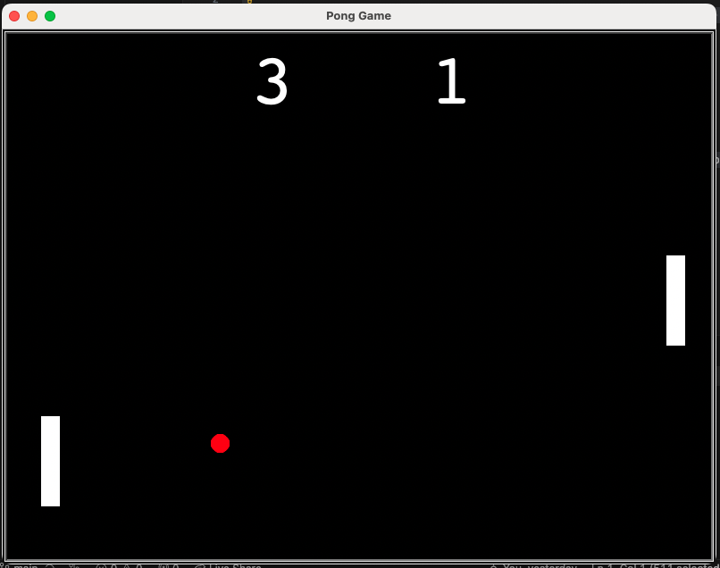

# Pong Game

I built this small game project in Python as part of the 100 Days of Code in Python course. This game allows users to play pong game and record their scores. 

# Technologies

* [Python](https://www.python.org/)

# Minimum Viable Product

- Two users start with two paddles on the left and right side of the game window and uses keys "w", "s", up arrow and down arrow to move around the paddles to bounce a ball.  
- A scoreboard to record both players' scores when when one of the players misses a ball.
- Game will be restarted once the ball bounces out of the boundary and the ball will go to the winnder side after the restart. 
- The ball will go faster as the game continues. 

# Screenshots of The Application
